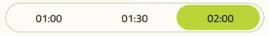

# SwitchSelector

Switch Selector to React Native.

[](https://badge.fury.io/js/react-native-switch-selector)
[](https://www.npmjs.com/package/react-native-switch-selector)

### SwitchSelector



### SwitchSelector - Custom Example


### Installing

```Shell
yarn add react-native-switch-selector
```

or

```Shell
npm i react-native-switch-selector --save
```

### Usage

```js
import SwitchSelector from "react-native-switch-selector";
```

```js
const options = [
  { label: "01:00", value: "1" },
  { label: "01:30", value: "1.5" },
  { label: "02:00", value: "2" }
];
```

```js
<SwitchSelector
  options={options}
  initial={0}
  onPress={value => console.log(`Call onPress with value: ${value}`)}
/>
```

### Custom Example

```js
<SwitchSelector
  initial={0}
  onPress={value => this.setState({ gender: value })}
  textColor={colors.purple} //'#7a44cf'
  selectedColor={colors.white}
  buttonColor={colors.purple}
  borderColor={colors.purple}
  hasPadding
  options={[
    { label: "Feminino", value: "f", imageIcon: images.feminino }, //images.feminino = require('./path_to/assets/img/feminino.png')
    { label: "Masculino", value: "m", imageIcon: images.masculino } //images.masculino = require('./path_to/assets/img/masculino.png')
  ]}
/>
```

### Props

| Prop                      | Type                    | Default     | Required | Note                                                                             |
| -------------------------  | ----------------------- | ----------- | -------- | -------------------------------------------------------------------------------- |
| options                    | array                   | null        | true     | Items array to render. Each item has a label and a value and optionals icons     |
| options[].label            | string                  | null        | true     | Label from each item                                                             |
| options[].value            | string                  | null        | true     | Value from each item                                                             |
| options[].customIcon       | Jsx element ou Function | null        | false    | Optional custom icon from each item                                              |
| options[].imageIcon        | string                  | null        | false    | Source from a image icon form each item. Has the same color then label in render |
| options[].activeColor      | string                  | null        | false    | Color from each item when is selected                                            |
| initial                    | number                  | -1          | false    | Item selected in initial render                                                  |
| value                      | number                  | undefined   | false    | The switch value (will call onPress)                                             |
| onPress                    | function                | console.log | true     | Callback function called after change value.                                     |
| disableValueChangeOnPress  | bool                    | false       | false    | Disables the onPress call when the value is manually changed                     |
| fontSize                   | number                  | null        | false    | Font size from labels. If null default fontSize of the app is used.              |
| selectedColor              | string                  | '#fff'      | false    | Color text of the item selected                                                  |
| buttonMargin               | number                  | 0           | false    | Margin of the item selected to component                                         |
| buttonColor                | string                  | '#BCD635'   | false    | Color bg of the item selected                                                    |
| textColor                  | string                  | '#000'      | false    | Color text of the not selecteds items                                            |
| backgroundColor            | string                  | '#ffffff'   | false    | Color bg of the component                                                        |
| borderColor                | string                  | '#c9c9c9'   | false    | Border Color of the component                                                    |
| borderRadius               | number                  | 50          | false    | Border Radius of the component                                                   |
| hasPadding                 | bool                    | false       | false    | Indicate if item has padding                                                     |
| animationDuration          | number                  | 250         | false    | Duration of the animation                                                        |
| valuePadding               | number                  | 1           | false    | Size of padding                                                                  |
| height                     | number                  | 40          | false    | Height of component                                                              |
| bold                       | bool                    | false       | false    | Indicate if text has fontWeight bold                                             |
| textStyle                  | object                  | {}          | false    | Text style                                                                       |
| selectedTextStyle          | object                  | {}          | false    | Selected text style                                                              |
| textContainerStyle         | object                  | {}          | false    | Style for text (and icon) container (TouchableOpacity)                           |
| selectedTextContainerStyle | object                  | {}          | false    | Style for selected text (and icon) container (TouchableOpacity)                  |
| imageStyle                 | object                  | {}          | false    | Image style                                                                      |
| style                      | object                  | {}          | false    | Container style                                                                  |
| returnObject               | bool                    | false       | false    | Indicate if onPress function return an option instead of option.value            |
| disabled                   | bool                    | false       | false    | Disables the switch                                                              |
| borderWidth                | number                  | 1           | false    | Define border width

### Authors

- Lucas Santana Carneiro - [jkdrangel](https://github.com/jkdrangel)
- Cássio Silva de Sá Santos - [ssscassio](https://github.com/ssscassio)
- [Contributors](https://github.com/App2Sales/react-native-switch-selector/graphs/contributors)

### Contribute

Contributions are always welcome! Create a new Pull Request
